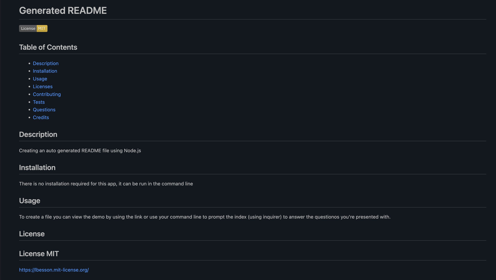

# Auto-README
A Professional README Generator
## Description
The goal of this application was to create a comman-line app using Node.js that would auto generate a README file. 

A high quality README is an important part of any project and this application will allow the user to create one effectively and efficiently. 

## Table of Contents 

- [Installation](#installation)
- [Usage](#usage)
- [Credits](#credits)
- [License](#license)

## Installation

There is no installation required for this project. You can clone the files in GitHub or use the link in the usage section (below) to view the code on GitHub along with the video link demonstrating the "Auto-REAMDE" app in action.   

## Usage

https://sharareh18.github.io/rain-or-shine/

## Credits

Online Tutorials and Resources:

-  lukas-h: Markdown License badges : https://gist.github.com/lukas-h/2a5d00690736b4c3a7ba#apache-20-license
-  Downloading and Installing Packages Locally: https://docs.npmjs.com/downloading-and-installing-packages-locally
-  Node.js Docs: fs write: https://nodejs.org/api/fs.html#fswritefilefile-data-options-callback
-  Understanding module.exports and exports in Node.js:  https://www.sitepoint.com/understanding-module-exports-exports-node-js/
-  GitHub Licenses:  https://docs.github.com/en/rest/licenses?apiVersion=2022-11-28

University of California Irvine Full Stack Development Bootcamp 2023 Resources:

-  UCI Bootcamp Slack Study Group:  https://ucivirtfsfpt0-bgx3057.slack.com/archives/C056LT7DUUF
-  UCI Web Development Tutor Jacob Carver:  https://github.com/jacobcarver
-  UCI Bootcamp Module 9 Node.JS: activities 8, 10, 14, 17, 18, 20, Mini Project 

## License

None
